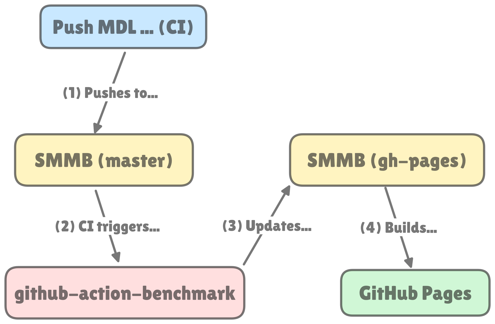
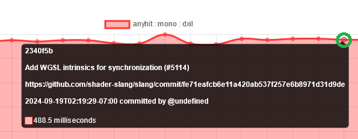
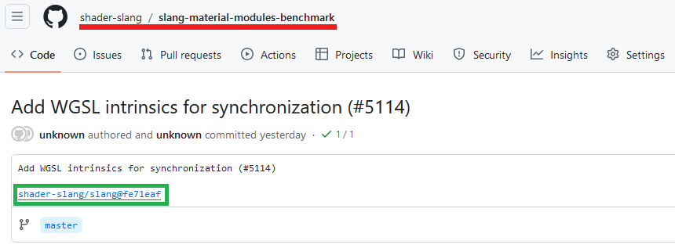
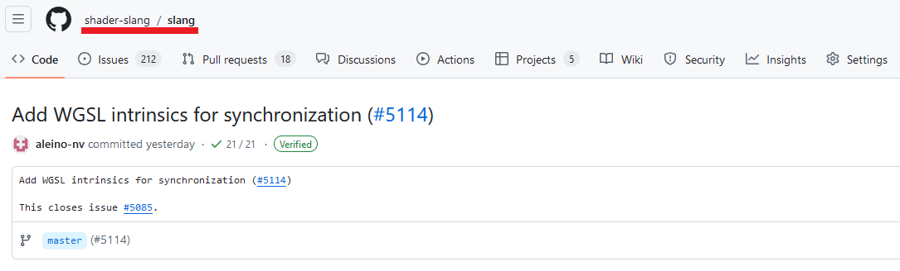

# Material Modules Benchmark

[**See the charts here**](https://shader-slang.com/slang-material-modules-benchmark/dev/bench)

**How it works:**
1. Commits to the master branch of [Slang](https://github.com/shader-slang/slang) will trigger a CI workflow that [runs the benchmark](https://github.com/shader-slang/slang/actions/workflows/push-benchmark-results.yml) and uploads the JSON file to **this** repository (specifically to `benchmarks.json`).
2. Changes to `benchmark.json` will trigger a CI workflow in this repository.
3. This workflow updates the `gh-pages` repository using [`github-action-benchmark`](fffffhttps://github.com/benchmark-action/github-action-benchmark). It reads the new results from `benchmarks.json` and updates a database in `gh-pages`.
4. Once `gh-pages` receives the update, it will trigger the final CI workflow that builds the GitHub Pages site.

The diagram below summarizes these steps.

*Notes:*
- In (1), the worflow from the Slang repository overrides `benchmarks.json` when it pushes to this repository; this is expected to happen.
- This repository contains another file, `currrent`, which holds the latest commit's message and hash for debugging purposes.
- Each time `benchmarks.json` is updated (2), the `github-action-benchmark` workflow reads its contents and appends a database that is embedded in a [Javascript file](https://github.com/shader-slang/slang-material-modules-benchmark/blob/gh-pages/dev/bench/data.js).
- There is currently no behaviour to limit the number of entries in the database, so it can grow to a couple megabytes. Manually trimming the data is possible by directly editing the Javascript file and removing entries.

**How to read the charts:**
- Each chart is title with the format `<SHADER STAGE> : <COMPILATION MODE> : <TARGET>`
  - `<SHADER-STAGE>` is one of `closesthit`, `anyhit`, and `shadow`
  - `<COMPILATION-MODE>` is either `mono` for monolithic compilation or `module` for modular compilation.
  - `<TARGET>` is currently fixed to DXIL.
    - Other targets can be generated by running the benchmarking script with a different target (DXIL or SPIRV; with or without precompiled modules).
- The $x$-axis tracks the commit hash. Unfortunately there is currently no way to display concrete dates.
- The $y$-axis shows the time, in milliseconds, taken to compile the specific shader stage under the particular compilation mode and target.

**Interacting with the charts:**

In case there is a commit which results in alarming measurements, there is a convenient way to reach the original commit/PR. Each data point of each graph can be highlighted as so:

Clicking on the node will result in a redirection to the associated commit in **this** repository.

Clicking on the highlighted link will then redirect the user to original commit/PR in the Slang repository.

